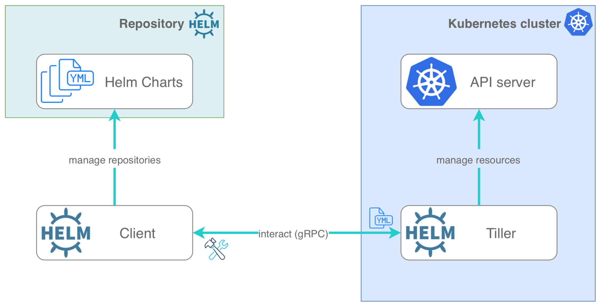
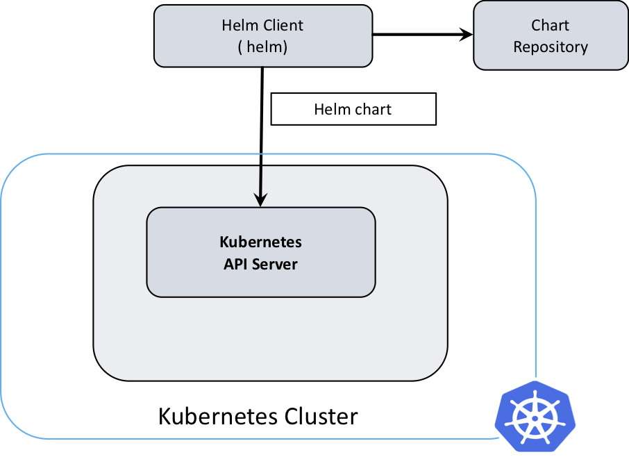

# Helm

> The complete recording of the session is available at https://web.microsoftstream.com/video/d1fca0ff-0400-b9eb-8bcb-f1eb3938799d

- Origin: Internal project called **Deis**.
- written in Go.
- Helm was developed by Google, and now is part of a maintained project in CNCF.
- Helm v3 has been GA since Nov, 2019, and Helm v2 has been deprecated since Nov 2020.

#### 3 main components:

> 1. <b>Chart</b>: Helm Package. Actual Yamls describing the Application.
> 2. <b>Repository</b>: Place where charts are stored and shared.
> 3. <b>Releases</b>: Instance of a chart "running" in K8s.

######  Helm v2 architecture:
- Client

- Tiller

- Tiller uses a <b>Service Account</b> to talk to the API Server. Generally it is allowed a lot of access initially to get things working, which possesses a security risk. Thus it was removed.

- Tiller and Helm client interacted using <b>gRPC</b>

  

  *Source: https://medium.com*


###### Helm v3 architecture

- Only client

- The permissions of the client are same as the kubectl user that is accessing the cluster

- The Helm binary talks to API Server using <b>REST(JSON)</b> using a Go binary client for Kubernetes

  


###### [Difference between Helm v2 and v3](https://helm.sh/docs/topics/v2_v3_migration/).

- Tiller is gone
- Service Account for Helm is not required
- Helm is now namespaced, instead of being clusterwide. So something like "helm list" should be used with "--all-namespaces" flag.
- Chart apiVersion is now "v2", so if a client complains that they are getting error version "v1" not expected, they are trying to use Helm v2 charts with Helm v3.
- Helm init not required
- Commands removed/replaced/added:
  - delete --> uninstall : removes all release history by default (previously needed --purge)
  - fetch --> pull
  - init (removed)
  - install: requires release name or --generate-name argument
  - reset (removed)
- Helm 3 not has a client library that can be incorporated in an existing application. So if there is a Go code, where you want to perform your own operation on Helm Charts, the Helm 3 library can be imported into it.
- Helm 3 now patches changes. So the current state is matched with the new state, rather than the previously defined state. For example: If there is a Service Mesh and the Mesh is injecting sidecard into the Pods, which was not part of the Helm chart, and you performed an rollback. Instead of going to the original configuration, which did not have the sidecars, it will only patch the changes, and in case of rollback, it will only revert the changes being made.
- One of the major changes on which other tools can be developed: <b>JSON Schema</b>. Apart from the validation (at the helm install step), now you can define how the values should look like, with their structure. This can be utilized by a code piece and an UI interface can be built on top of it.

###### Migration use cases for Helm:
1. Have both version on same system, test the new release and then change the DNS to point to new release. Once done, the previous release can be removed.
     - This requires special attention to Cluster wide resources like ClusterRoles. In such a case, the v3 components can be renamed.
2. Migrating directly from v2 to v3
     - Required when the Helm v2 releases are to be managed by v3.
     - It should be noted that for Helm v2, the client has 1:many relation with the clusters. Meaning one client can point to multiple Tillers.
     - The migration is automated with Helm <b>2to3</b> plugin, for which we will see a demo.

---

## Helm v2 to v3 migration

For this migration, I used one of the Plugins supported by Helm version 3: https://github.com/helm/helm-2to3.

Since I did not have a cluster running Helm charts on version 2, I created a new cluster and configured 1 chart using Helm v2 and migrated that to Helm v3.

Please note that **most of the providers now do not support Helm v2 deployments** as it has been deprecated since 13th November 2020.

Two major changes brought in with Helm v3:

1. **Tiller has been removed**:

   This means that in the cluster, there will be no Tiller Pod. The client-server model used in Helm v2 will now be replaced with Client only model. The configurations will be managed by ConfigMaps and Secrets.

2. **The chart apiVersion has now been moved from "v1" to "v2”.**

   Although the charts with apiVersion as "v1" (Helm v2) are still installable on Clusters, most of the available charts from 3rd party vendors have now moved to apiVersion v2" (Helm v3)

Before starting, the 2 main documents that I referred for the migration are:

> - https://helm.sh/docs/topics/v2_v3_migration/
> - https://helm.sh/blog/migrate-from-helm-v2-to-helm-v3/ 

These articles contain all the useful commands and best practices that should be followed during the migration process. Please refer these for queries.

 

For the migration, I used my **Linux VM** from where I had configured the charts on Helm v2, **and installed another instance of Helm on it, but with Helm v3**.

```bash
$ curl -sLO https://get.helm.sh/helm-v3.4.1-linux-amd64.tar.gz
$ tar -zxvf helm-v3.4.1-linux-amd64.tar.gz
$ mv linux-amd64/helm /usr/local/bin/helm3
 
$ helm3 version
version.BuildInfo{Version:"v3.4.1", GitCommit:"c4e74854886b2efe3321e185578e6db9be0a6e29", GitTreeState:"clean", GoVersion:"go1.14.11"}
```

NOTE: Whenever you install both versions of Helm on the same machine, please make sure that they are installed in different directories and are identified by a different Path variable.

Once Helm v3 was installed, I ran the commands to **check the Plugins and Repos available with Helm v3**, and confirmed that it is empty as of now: 

```bash
$ helm3 repo ls
Error: no repositories to show
 
$ helm3 ls
NAME    NAMESPACE       REVISION        UPDATED STATUS  CHART   APP VERSION
 
$ helm3 plugin ls
NAME    VERSION DESCRIPTION
2to3    0.7.0   migrate and cleanup Helm v2 configuration and releases in-place to Helm v3
```

**NOTE**: The Plugin 2to3 was installed using the following commands: 

```bash
$ helm3 plugin install https://github.com/helm/helm-2to3
```

While for Helm v2, I could see some repos:

```bash
$ helm version
Client: &version.Version{SemVer:"v2.16.2", GitCommit:"bbdfe5e7803a12bbdf97e94cd847859890cf4050", GitTreeState:"clean"}
helm repoServer: &version.Version{SemVer:"v2.16.2", GitCommit:"bbdfe5e7803a12bbdf97e94cd847859890cf4050", GitTreeState:"clean"}
 
$ helm repo list
NAME            URL
local           http://127.0.0.1:8879/charts
nginx-stable    https://helm.nginx.com/stable
 
$ helm plugin list
NAME    VERSION DESCRIPTION
 
$ helm list
NAME            REVISION        UPDATED                         STATUS          CHART                   APP VERSION     NAMESPACE
nginx-ingress   1               Sat Nov 28 06:12:55 2020        DEPLOYED        nginx-ingress-0.7.1     1.9.1           default
 
```

Once everything was in place, I used the Plugin to do the migration:

1. **Migrated the Configuration:**

```bash
$ helm3 2to3 move config
2020/11/28 06:22:38 WARNING: Helm v3 configuration may be overwritten during this operation.
2020/11/28 06:22:38
[Move config/confirm] Are you sure you want to move the v2 configuration? [y/N]: y
```

​    		After which, I was able to see the repositories moved to version 3:

```bash
$ helm3 repo ls
NAME            URL
local           http://127.0.0.1:8879/charts
nginx-stable    https://helm.nginx.com/stable
```

2. **Migrated the Releases:**

 ```bash
## Checking the releases in v2:
$ helm list
helm3NAME               REVISION        UPDATED                         STATUS          CHART                   APP VERSION     NAMESPACE
nginx-ingress   1               Sat Nov 28 06:12:55 2020        DEPLOYED        nginx-ingress-0.7.1     1.9.1           default
 
## Ensuring that there are no releases in v3:
$ helm3 ls
NAME    NAMESPACE       REVISION        UPDATED STATUS  CHART   APP VERSION
 
## Using the Plugin for Migration:
$ helm3 2to3 convert nginx-ingress
 
## Ensuring that the migration was successful:
$ helm3 ls
NAME            NAMESPACE       REVISION        UPDATED                                 STATUS          CHART                   APP VERSION
nginx-ingress   default         1               2020-11-28 06:12:55.775520773 +0000 UTC deployed        nginx-ingress-0.7.1     1.9.1

 ```

3. **Cleaned up the Helm v2 configuration:**

```bash
$  helm3 2to3 cleanup
WARNING: "Helm v2 Configuration" "Release Data" "Tiller" will be removed.
This will clean up all releases managed by Helm v2. It will not be possible to restore them if you haven't made a backup of the releases.
Helm v2 may not be usable afterwards.
 
[Cleanup/confirm] Are you sure you want to cleanup Helm v2 data? [y/N]: y
 
## Ensuring that the configuration was removed for Helm v2:
$ helm ls
Error: could not find a ready tiller pod
```

4. **Verify if the migrated release can be managed by Helm v3:**

```bash
$ helm3 repo update
Hang tight while we grab the latest from your chart repositories...
...Unable to get an update from the "local" chart repository (http://127.0.0.1:8879/charts):
        Get "http://127.0.0.1:8879/charts/index.yaml": dial tcp 127.0.0.1:8879: connect: connection refused
...Successfully got an update from the "nginx-stable" chart repository
Update Complete. ⎈Happy Helming!⎈ 
```

With this, I was able to migrate the workload to version 3.

There were some roadblocks during the installation:

1. With a Windows Client, the **2to3** Plugin does not work out of     the box, as it uses “/bin/sh”. You will need to use [Windows Subsystem for Linux](https://docs.microsoft.com/en-us/windows/wsl/install-win10). Thus, I used a Linux VM instead.
2. There were a lot of issues with the RBAC part. The commands I shared above and in the Footnotes, are the summary. However, depending on your environment, you may need to introduce other commands as well.

If you want to take the different approach of having both the installations (v2 and v3) of any chart at the same time, and do, for example, a DNS switch to the new chart, you can do that as well. Please make sure that the installations are managed separately in different namespaces, and do not have overlapping resources. The setup I have, is a standard setup, which does not have a lot of configuration settings, thus the migration went on smoothly. But for production environment, there will be additional dependencies which needs to be taken into consideration.

---

### Footnotes:

[1] Using the *--dry-run* flag is a good idea to see the changes that will be made before the actual migration.

[2] Keep a copy of the configuration and settings for Helm v2. More considerations to keep in mind: https://github.com/helm/helm-2to3#overview

[3] Never use Helm version **2.16.4**. It does not work well with the CloudProviders when there are RBAC access involved for the cluster. Either use an older version, or use version 2.16.5+.

You can reset the Tiller installation using ***helm reset --force\***

[4] Before helm init, ensure that the Tiller Service Account has proper access. One quick way of doing it is: 

```bash
$ kubectl create serviceaccount -n kube-system tiller
$ kubectl create clusterrolebinding tiller-binding --clusterrole=cluster-admin --serviceaccount kube-system:tiller
$ helm init --service-account tiller
```

[5] Installation of the Ingress Controller with Helm v2:

```bash
$ git clone https://github.com/nginxinc/kubernetes-ingress/
$ cd kubernetes-ingress/deployments/helm-chart
$ git checkout v1.9.1
$ helm repo add nginx-stable https://helm.nginx.com/stable
$ helm repo update
$ kubectl create -f crds/
$ helm install --name nginx-ingress nginx-stable/nginx-ingress

```

[6] You can verify the installation using the following commands: https://kubernetes.github.io/ingress-nginx/deploy/#detect-installed-versions

[7] Installation of Helm v2 (for testing): 

```bash
$ curl -sLO https://get.helm.sh/helm-v2.16.10-linux-amd64.tar.gz
$ tar -zxvf helm-v2.16.10-linux-amd64.tar.gz
$ mv linux-amd64/helm /usr/local/bin/helm
$ helm
```

